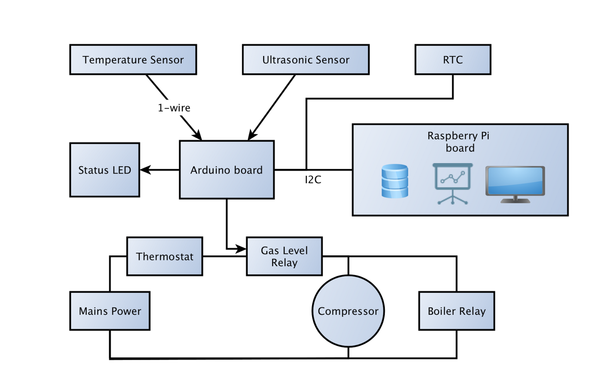
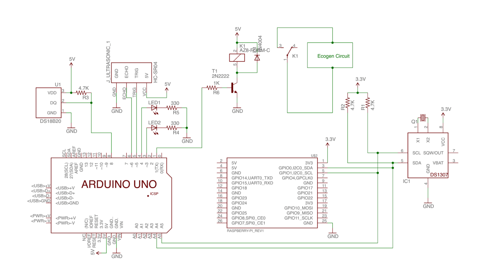
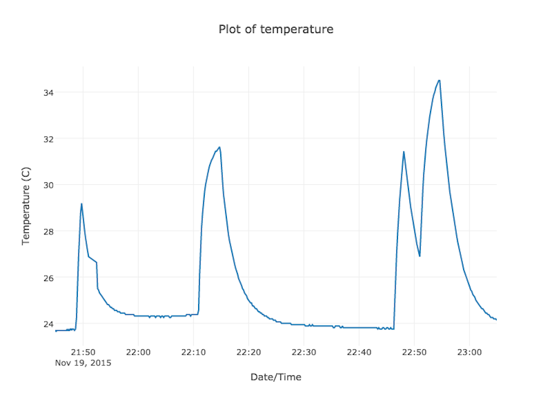

# Micro Anaerobic Digester Control and Monitoring System

This project allows the biogas produced from small-scale anaerobic digesters
to be put to two different uses and, at the same time, records various
measurements from the system.
A system diagram is shown below and further below is a circuit diagram of how the systems are connected.

 * Arduino_Slave or Arduino_Slave_Button_Relay runs on an [Arduino](https://www.arduino.cc/) micro-controller.
 * RPi_webserver runs on a [Raspberry Pi](https://www.raspberrypi.org/), providing logging and plotting.
 * RPi_Master runs on a Raspberry Pi and acts as an [I2C](https://en.wikipedia.org/wiki/I%C2%B2C) bridge between the Arduino and Raspberry Pi.

## System Diagram

The Arduino monitors the amount of stored biogas in the gas tank using an ultrasonic
and temperature sensor. If there is enough biogas then the system decides whether
to generate hot water for heating or produce biogas for cooking.

## Dependencies

- C used in Arduino for system control. Arduino IDE 1.6.5 was used.
- Raspberry Pi components use Python 2.7. Packages used include:
  - [sqlite3](https://docs.python.org/2/library/sqlite3.html) for the database.
  - [flask](http://flask.pocoo.org/) for the webserver.
  - [py-smbus](http://www.lm-sensors.org/browser/i2c-tools/trunk/py-smbus/) for accessing the I2C bus on the Raspberry Pi.
  - [plotly](http://www.plot.ly/) for plotting.

## Control and Monitoring Subsystem Electronics

## Example Plot

